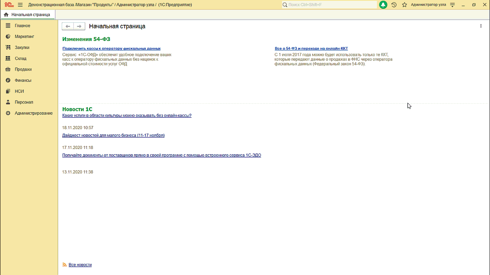
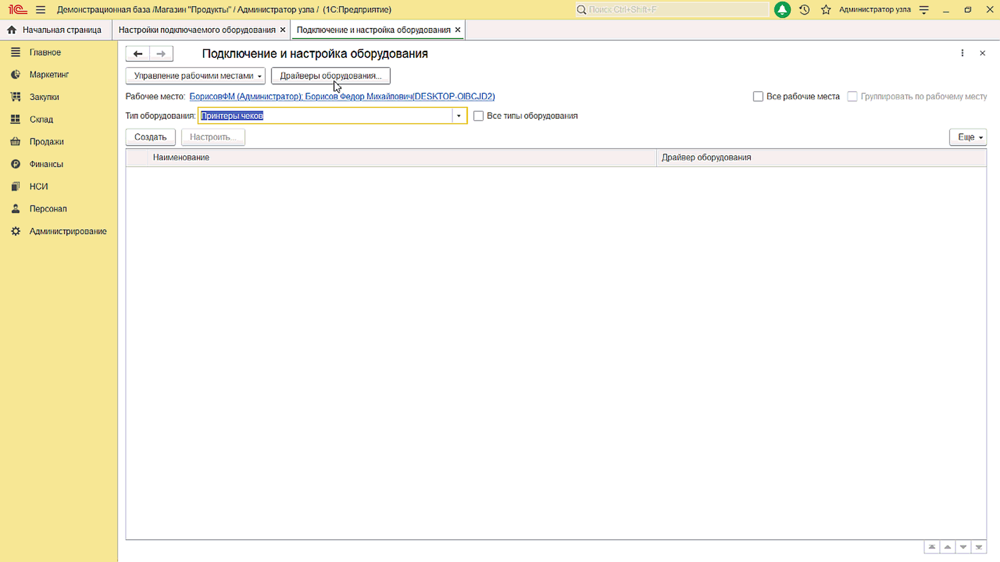
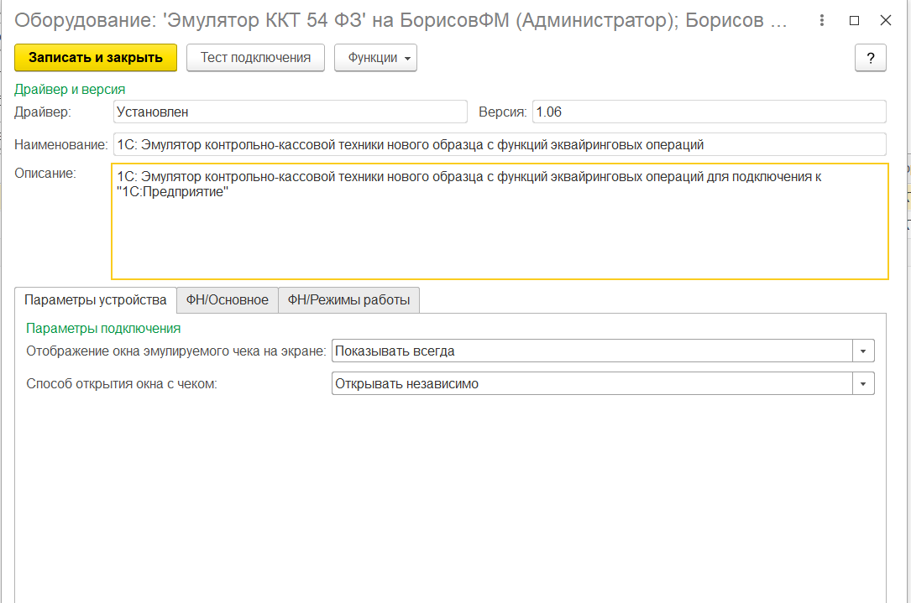
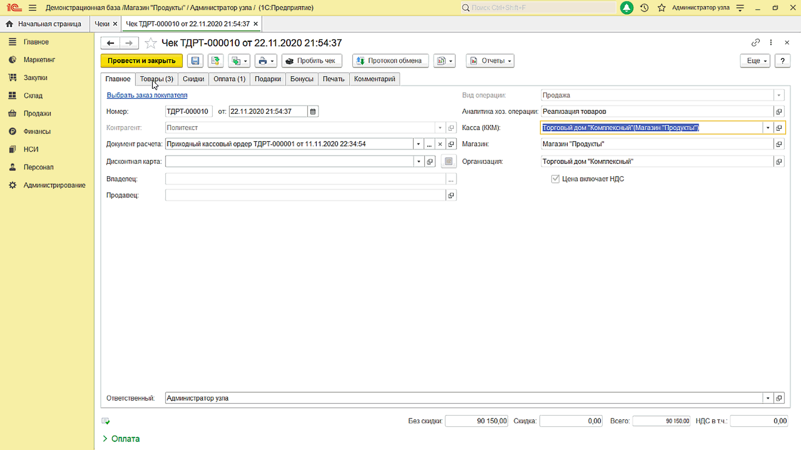

# Эмулятор контрольно-кассовой техники для управляемых форм 1С с поддержкой ревизии 3002 #

Эмулятор позволяет печатать чеки, а также выводить их на экран в программе 1С без необходимости физического подключения фискальных регистраторов.

Представляет из себя расширение, которое подключается к конфигурациям фирмы 1С, со встроенной библиотекой подключаемого оборудования (БПО). Вместо расширения, при желании, функционал можно встроить и в конфигурацию.

## Требования к конфигурации 1С ##

- в конфигурацию встроена [Библиотека подключаеого оборудования (БПО)](https://1c.ru/news/info.jsp?id=22373) версии [2.1.3](https://releases.1c.ru/version_files?nick=CEL21&ver=2.1.3.2) или выше
- Версия платформы 1С не ниже 8.3.9 (из-за особенностей механизма расширений)
- Режим совместимости конфигурации выше 8.3.8(из-за особенностей механизма расширений)
- конфигурация на управлямых формах

## Особенности эмулятора ##

- Эмулятор разработан согласно требования к драйверам 1С 3.2 - ревизия интерфейса - [**3002**](https://its.1c.ru/db/metod8dev#content:5974:hdoc).
- Работает с конфигурациями ERP, Управление Торговлей 11, Розница 2, Управление нашей фирмой, Бухгалтерия 3.0 и любыми отраслевыми конфигурациями, что имеют в составе БПО.
- Работает на 32х и 64х платформах 1С
- Можно использовать в тонком и веб-клиенте
- Поддерживает операционные системы: Widndows, Linux, MacOS.

## Подключение ##

1. Добавьте расширение в список расширений конфигураций

    

2. В справочник "Драйверы оборудования" добавьте оборудование "Эмулятор" из архива [KSOFT_Emulator.zip](KSOFT_Emulator.zip)

    

3. Добавьте новую строку в список [подключенного оборудования](https://its.1c.ru/db/kkt#content:84:hdoc) на текущем рабочем месте.

4. Перезапустите 1С
5. Настройте параметры подключенного оборудования

    

6. Напечайте чек.

   

### Проверено на конфигурациях ###

- Розница 2.3.6.17
- Управление Торговлей 11.4.12.75
